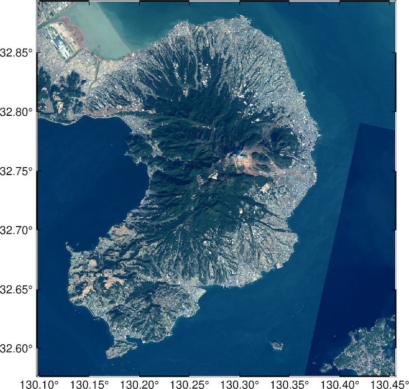

<a name="readme-top"></a>
<!-- TABLE OF CONTENTS -->
<details>
  <summary>Table of Contents</summary>
  <ol>
    <li>
      <a href="#emtools">EMTools</a>
      <ul>
        <li><a href="#makekmz">makeKMZ</a></li>
      </ul>
    </li>
    <li><a href="#license">License</a></li>
    <li><a href="#contact">Contact</a></li>
  </ol>
</details>

<br>

<!-- ABOUT THE PROJECT -->
# EMTools

The EMTools consists of several programs useful for geosciences.

## makeKMZ
Python code to create a KMZ file to plot colored circle icons in Google Earth by using the lists of longitudes, latitudes and values.

### Requirements
- Python 3.9.15
- matplotlib 3.6.3
- numpy 1.23.5
- pillow 9.4.0

### Usage
Just import `MakeKMZ` and call the `make_kmz` function.
```python
import makeKMZ
makeKMZ.make_kmz(kmzname, lon, lat, values, list_label)
```
where parameters are

    kmzname (str): Name of the output KMZ file.
    lon ([float]): Array of longitudes.
    lat ([float]): Array of latitudes.
    values ([float]): Array of values used for the color scale.
    list_label ([str]): List of labels of icons.

### Demo
See `example/earthquakes.py`, which creates a map of the [20 largest earthquakes](https://www.usgs.gov/programs/earthquake-hazards/science/20-largest-earthquakes-world) listed on the USGS website.

The screenshot of the output kmz file opened in Google Earth is 


<p align="right">(<a href="#readme-top">back to top</a>)</p>


## getGSIMaps
Python code to download tile images of [GSI Maps](https://maps.gsi.go.jp). Downloaded image can be used to plot the map by GMT (PyGMT) as the background.

### Requirements
- Python 3.9.16
- numpy 1.23.3
- pillow 9.3.0
- pygmt 0.8.0 (to run the example code)

### Usage
Just import `getGSIMaps` and call the `create_image` function.
```python
import getGSIMaps
getGSIMaps.create_image(out_image_name, lon1, lat1, lon2, lat2, zoom = None, map_type = 'std'):
```
where parameters are

    out_image_name (str): Output image name
    lon1 (float): Longitude of the bottom left corner of the region
    lat1 (float): Latitude of the bottom left corner of the region
    lon2 (float): Longitude of the top right corner of the region
    lat2 (float): Latitude of the top right corner of the region
    zoom (int, optional): Zoom level of the tile. 1:global to 18:local. Defaults to None.
    map_type (str, optional): Tile ID of the map type. 'std', 'pale', 'english', 'seamlessphoto', and etc. (See https://maps.gsi.go.jp/development/ichiran.html). Defaults to 'std'.
    
### Demo
See `example/plotGSIMaps.py`, which plot a map of Shimabara Penuinsula by PyGMT with the satellite image as the background.

The output image of this demo is 
||
|:--:| 
| This map is based on the photo published by Geospatial Information Authority of Japan. Data resources: Landsat8 (GSI, TSIC, GEO Grid/AIST), Landsat8 (courtesy fo the U.S. Geological Survey), Bathymetry (GEBCO) |

<p align="right">(<a href="#readme-top">back to top</a>)</p>

<!-- LICENSE -->
## License

Distributed under the MIT License. See `LICENSE` for more information.

<p align="right">(<a href="#readme-top">back to top</a>)</p>


<!-- CONTACT -->
## Contact

Kentaro Emoto - emoto.kentaro.430@m.kyushu-u.ac.jp

Project Link: [https://github.com/KentaroEmoto/EMTools](https://github.com/KentaroEmoto/EMTools)

<p align="right">(<a href="#readme-top">back to top</a>)</p>


